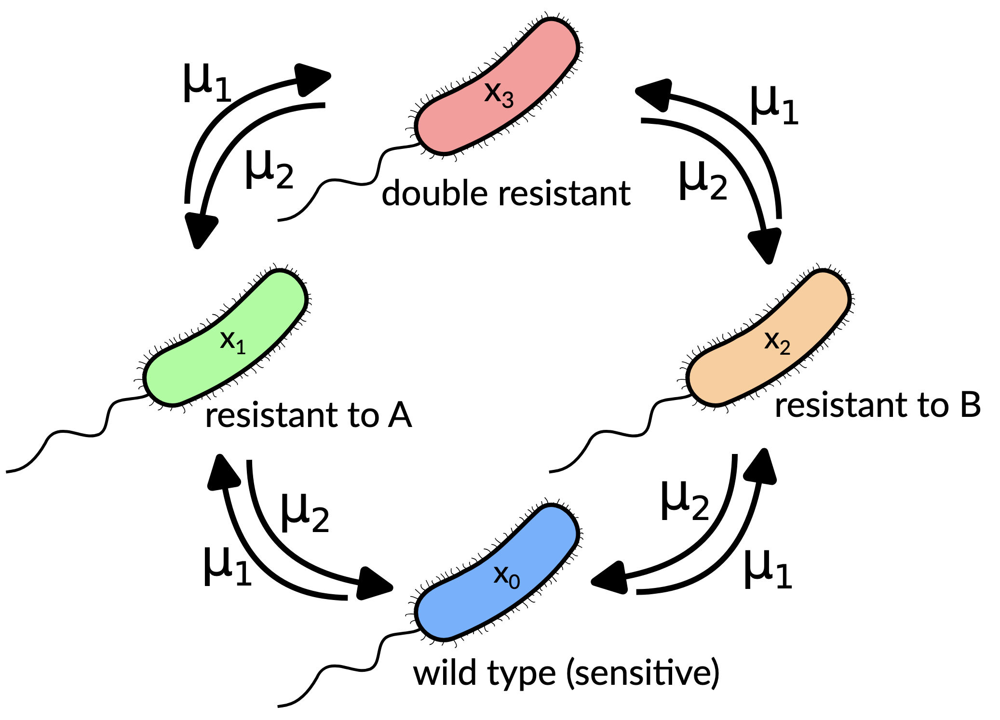

# Optimization of sequential therapies to maximize extinction of resistant bacteria through collateral sensitivity

  

Authors: *Javier Molina-Hernández, José A. Cuesta, Beatriz Pascual-Escudero, Saúl Ares, Pablo Catalán.*

This code enables the results obtained in the paper to be reproduced.

<justify>  There is a Python notebook for each figure, as indicated in the file names. These notebooks use CSV files generated with the included C++ codes. Due to size constraints, some of the CSV files have been split and can be reconstructed using 'cat', as indicated in the notebooks.</justify>

<justify> *Abstract*: Antimicrobial resistance (AMR) threatens global health. A promising and underexplored strategy to tackle this problem are sequential therapies exploiting collateral sensitivity (CS), whereby resistance to one drug increases sensitivity to another. Here, we develop a four‐genotype stochastic birth–death model with two bacteriostatic antibiotics to identify switching periods that maximize bacterial extinction under subinhibitory concentrations. We show that extinction probability depends nonlinearly on switching period, with stepwise increases aligned to discrete switch events: fast sequential therapies are suboptimal as they do not allow for the evolution of resistance, a key ingredient in these therapies. A geometric distribution framework accurately predicts cumulative extinction probabilities, where the per‐switch extinction probability rises with switching period. We further derive a heuristic approximation for the extinction probability based on times to fixation of single-resistant mutants. Sensitivity analyses reveal that strong reciprocal CS is required for this strategy to work, and we explore how increasing antibiotic doses and higher mutation rates modulate extinction in a nonmonotonic manner. Finally, we discuss how longer therapies maximize extinction but also cause higher resistance, leading to a Pareto front of optimal switching periods. Our results provide quantitative design principles for \emph{in vitro} and clinical sequential antibiotic therapies, underscoring the potential of CS‐guided regimens to suppress resistance evolution and eradicate infections.3</justify>
